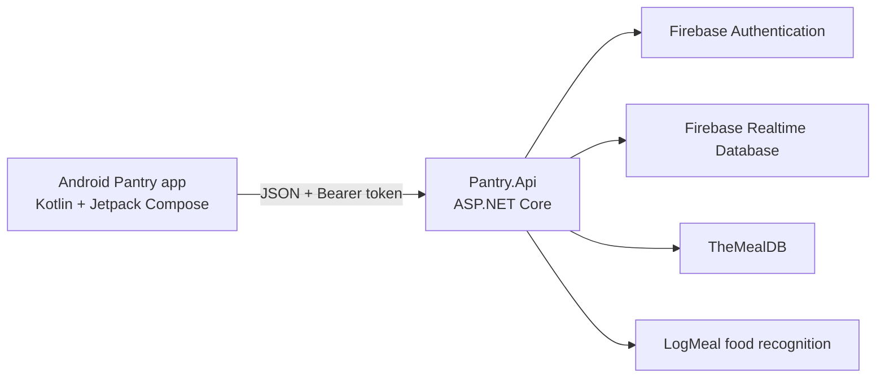

# Pantry — PROG7314 Part 2

**Module:** PROG7314  
**Assessment:** Part 2 prototype  
**Group:** EMGPPT  
**Repository:** [EMGPPT/prog7314-2026-prog7314-2026-part2-blessing-unlimited](https://github.com/EMGPPT/prog7314-2026-prog7314-2026-part2-blessing-unlimited)

| Member | Student GitHub |
| --- | --- |
| Sihle Nathi Simelane | [`Sihl3s`](https://github.com/Sihl3s) |
| Blessing Makhukhula | [`blessing-unlimited`](https://github.com/blessing-unlimited) |
| Regopotsoe Lesedi Khutoane | [`ST10443296`](https://github.com/ST10443296) |
| Nomathamsanqa Tame | [`NomathamsanqaTame`](https://github.com/NomathamsanqaTame) |

Pantry is an Android recipe application that starts from **what is already in the kitchen**. A signed-in user keeps a digital pantry and receives recipes ranked by how many ingredients they already own. Ranking, pantry persistence, shopping lists, and food recognition run on a **custom hosted REST API**. TheMealDB is used only as the recipe catalogue (TheMealDB, 2026).

## Demonstration videos

| Recording | Link |
| --- | --- |
| Part 2 mobile application demonstration | https://youtu.be/74z5YRa-JMU |
| Part 2 API, Swagger and code walkthrough | https://youtu.be/XWsTvCrPVqk |

## Hosted API (for marking)

| Resource | URL |
| --- | --- |
| Live API | https://pantry-api-8x99.onrender.com/ |
| Swagger | https://pantry-api-8x99.onrender.com/swagger/index.html |

## Screenshots


The API is containerised ([Dockerfile](Dockerfile)) and deployed on Render. User pantry, settings, shopping lists, and profiles persist in **Firebase Realtime Database**. Google identity is handled through **Firebase Authentication**. Camera photos are identified with **LogMeal** on the server so the recognition key is not shipped in the APK (Firebase, 2026; LogMeal API, 2026).

## Features delivered

**Authentication and profile**
- Google Sign-In (Firebase) and a development SSO session against `POST /api/v1/auth/sso`
- First-login onboarding for dietary chips, allergens, and cuisine preference, saved with `PATCH /api/v1/users/me/settings`
- Profile settings with XP, level title, streak, and achievement badges

**Pantry and reverse-pantry matching**
- Pantry CRUD (`/api/v1/pantry-items`)
- Reverse-pantry match (`POST /api/v1/recipes/match`) that ranks TheMealDB meals by match percentage, ingredients already owned, and ingredients still missing
- Recipe search and recipe detail from the custom API

**Scan and shopping**
- CameraX and gallery scan through `POST /api/v1/food-recognition/identify` and `/confirm`
- Shopping-list generate and CRUD from missing recipe ingredients
- Pantry-aware substitutions (`GET /api/v1/substitutions/{ingredientId}`)

**Cook mode**
- Hands-free cook mode: one instruction at a time, swipe / previous / next, keep-screen-on, and a per-step timer

**Quality**
- xUnit tests for matching and shopping-list generation
- JUnit helpers on Android
- GitHub Actions: [API CI](.github/workflows/api-ci.yml) and [Android CI](.github/workflows/android-ci.yml)

Part 2 does **not** include biometrics, offline Room sync, push notifications, or multi-language support (deferred to the final POE as specified in the brief).

## Architecture



The Android client is a thin MVVM presenter (Jetpack Compose). Retrofit calls only `/api/v1/*`. Reverse-pantry ranking is performed on the API because TheMealDB’s free filter accepts **one** ingredient per request (TheMealDB, 2026; Android Developers, 2024). Persistence is scoped per authenticated user (OWASP, 2023).

**Visual identity (Part 1):** terracotta `#C45C26`, basil, and cream; Playfair Display with Source Sans 3; plate-and-steam mark; branded splash and sign-in; terracotta-pill bottom navigation.

## Custom API surface

| Method | Path | Purpose |
| --- | --- | --- |
| POST | `/api/v1/auth/sso` | Exchange an ID token for an API session |
| POST | `/api/v1/auth/logout` | End the session |
| GET | `/api/v1/users/me` | Current profile |
| GET / PATCH | `/api/v1/users/me/settings` | Dietary and match settings |
| GET / POST / PATCH / DELETE | `/api/v1/pantry-items` | Digital pantry |
| GET | `/api/v1/ingredients/search` | Ingredient lookup |
| GET | `/api/v1/recipes` | Catalogue search |
| GET | `/api/v1/recipes/{id}` | Recipe detail |
| POST | `/api/v1/recipes/match` | Reverse-pantry ranking |
| POST / GET / PATCH / DELETE | `/api/v1/shopping-lists` | Shopping lists |
| GET | `/api/v1/substitutions/{ingredientId}` | Pantry-aware substitutes |
| POST | `/api/v1/food-recognition/identify` | LogMeal image segmentation |
| POST | `/api/v1/food-recognition/confirm` | Confirm recognised ingredients |

## Group contributions

| Member | Contribution on `main` |
| --- | --- |
| **Sihle Nathi Simelane** (`Sihl3s`) | Custom ASP.NET API (SSO, settings, pantry CRUD, recipe search/detail, reverse-pantry match), Firebase Realtime Database project and local wiring, Android MVVM shell (splash, navigation, pantry, ranked recipes, settings), Part 1 brand, xUnit/JUnit coverage, GitHub Actions, CameraX/gallery scan UI and shopping-list screen wiring |
| **Blessing Makhukhula** (`blessing-unlimited`) | Shopping-list generate/CRUD, substitutions, LogMeal identify/confirm on the API, Google Sign-In configuration (`default_web_client_id`), Android testing |
| **Regopotsoe Lesedi Khutoane** (`ST10443296`) | Hands-free cook mode (keep-awake, step pager, timer), first-login onboarding, profile XP / badges / streak |
| **Nomathamsanqa Tame** (`NomathamsanqaTame`) | Dockerfile, Render hosting, Swagger of the live API, physical-device demonstration videos |

Each member committed from their own GitHub account.

## Repository layout

```
api/Pantry.Api/             Custom REST API
api/Pantry.Api.Tests/       xUnit tests (no network)
android/app/src/main/       Kotlin + Jetpack Compose client
Dockerfile                  Render image for Pantry.Api
.github/workflows/          API and Android CI
```

Secrets (`Firebase:BaseUrl`, `LogMeal:ApiToken`, `google-services.json`) are not stored in git. They are supplied as user secrets locally and as host environment variables on Render.

## References

Android Developers (2024) *Build a UI with Jetpack Compose*. Available at: https://developer.android.com/compose (Accessed: 21 September 2026).

Android Developers (2024) *Retrofit and networking on Android*. Available at: https://developer.android.com/guide/topics/connectivity (Accessed: 21 September 2026).

Fielding, R., Nottingham, M. and Reschke, J. (2022) *RFC 9110: HTTP Semantics*. RFC Editor. Available at: https://www.rfc-editor.org/rfc/rfc9110.html (Accessed: 21 September 2026).

Firebase (2026) *Firebase Authentication* and *Realtime Database REST API*. Available at: https://firebase.google.com/docs (Accessed: 21 September 2026).

LogMeal API (2026) *Image segmentation complete*. Available at: https://docs.logmeal.com/reference/post_v2-image-segmentation-complete (Accessed: 21 September 2026).

OWASP (2023) *OWASP API Security Top 10 – 2023*. Available at: https://owasp.org/API-Security/editions/2023/en/0x11-t10/ (Accessed: 21 September 2026).

TheMealDB (2026) *API documentation*. Available at: https://www.themealdb.com/api.php (Accessed: 21 September 2026).
